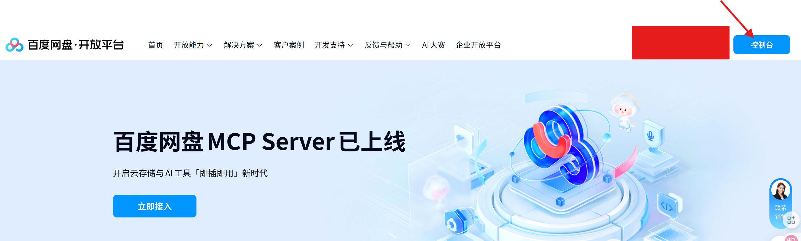
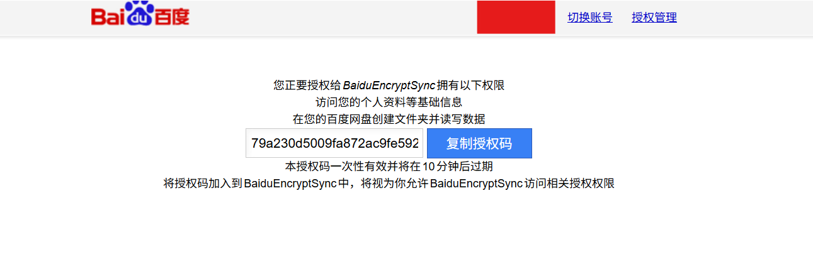

# Baidu Encrypt Sync - 百度网盘加密同步工具

**Baidu Encrypt Sync** 是一个功能强大的自动化工具，旨在监控本地文件夹的变更，并将新增或修改的文件实时、安全地上传到您的百度网盘。它支持端到端加密，确保您的数据在传输和云端存储过程中的绝对隐私。

---

## ✨ 功能特性

- **📁 实时文件监控**: 自动监控指定目录（包括子目录）中的文件创建和修改事件。
- **🔐 端到端加密**: 在上传前对文件进行 AES-256-CBC 加密，密码由您掌控，确保只有您能访问文件内容。
- **🔄 断点续传与分片上传**: 自动处理大文件分片上传，并支持断点续传，稳定高效。
- **🚀 多线程上传**: 利用多线程并行上传，最大化利用您的网络带宽，提升上传效率。
- **⚙️ 高度可配置**: 支持通过命令行参数和配置文件进行详细设置，如：
    - 递归或非递归监控。
    - 按文件类型、大小、名称模式进行过滤。
    - 排除特定目录。
    - 自定义远程存储路径。
- **🔁 存量文件扫描**: 支持在启动时扫描并上传监控目录中的所有现有文件。
- **🔑 自动令牌管理**: 自动处理 Access Token 的获取和刷新，无需手动干预。
- **🐳 多种部署方式**: 提供原生 Python、Docker 和 Docker Compose 多种部署选项，灵活适应不同环境。
- **🔓 配套解密工具**: 提供独立的解密脚本，方便您在任何地方下载和解密文件。


## 🚀 快速开始

在开始使用之前，请按照以下步骤完成必要的准备工作。
### 第零步：下载代码
 **克隆项目**
   ```bash
   git clone https://github.com/xianrenzhou/BaiduEncryptSync.git
   cd BaiduEncryptSync
   ```
   也可以直接下载代码压缩包
### 第一步：获取百度网盘开放平台应用信息

1. 访问 [百度网盘开放平台](https://pan.baidu.com/union/) 并登录您的百度账号。
2. 点击右上角控制台进入应用创建页面。

3. 创建应用，应用类别为软件，其余任写
4. 创建成功后，进入应用详情页面，获取您的 `AppKey`、`SecretKey` 和 `SignKey`，进入下一步填写配置文件。

<!-- [MANUAL_EDIT_SECTION: 请在此处添加获取AppKey、SecretKey和SignKey的详细步骤] -->
<!-- 示例内容：
1. 访问百度开放平台...
2. 创建应用...
3. 获取相关密钥...
-->

### 第二步：配置应用信息

进入 `config` 目录，在 `config.yaml`中填入您的应用信息：

```yaml
# config/config.yaml
AppKey: "你的AppKey"
SecretKey: "你的SecretKey"
SignKey: "你的SignKey"
# 以下字段由程序自动生成和管理，无需手动填写
AccessToken: ""
RefreshToken: ""
ExpireIn: 0
```

### 第三步：获取授权码

在浏览器中访问以下URL（请将 `你的AppKey` 替换为您的真实 AppKey），并完成授权：

```
https://openapi.baidu.com/oauth/2.0/authorize?response_type=code&client_id=你的AppKey&redirect_uri=oob&scope=basic,netdisk&device_id=你的AppID
```

授权成功后，页面会显示您的授权码（有效期十分钟，可以用的时候刷新），请保存此授权码，在首次运行程序时需要使用。

<!-- [ILLUSTRATION: 百度授权页面截图] -->
<!-- 示例:  -->

---

## 📦 部署方式

完成准备工作后，您可以选择以下任一方式部署程序：
### 飞牛用户：

后续步骤请参阅：[**飞牛专用部署说明 (FNOS_README.md)**](./FNOS_README.md)

### 方式一：Docker 部署 (推荐)

Docker 部署提供了最简洁的部署体验，无需担心环境依赖问题。
请参考 [**Docker 部署说明 (DOCKER_README.md)**](./DOCKER_README.md) 获取详细的 Docker 使用与配置方法，包括如何构建镜像、配置挂载目录、环境变量设置以及常见问题解答。

### 方式二：Python 原生部署

这种方式适合希望直接在系统中运行脚本，或需要自定义Python环境的用户。

#### 1. 环境准备

- **Python**: 确保您已安装 Python 3.10
- **Git**: 用于克隆项目


#### 2. 安装依赖

您可以选择以下任一方式安装依赖。

##### 选项一：使用 uv (推荐, 更快)

`uv` 是一个非常快速的 Python 包安装器，可以显著提升依赖安装速度。

1.  **安装 uv** (如果尚未安装):
    ```bash
    # Linux, macOS
    curl -LsSf https://astral.sh/uv/install.sh | sh
    # Windows
    powershell -c "irm https://astral.sh/uv/install.ps1 | iex"
    ```

2.  **使用 uv 创建虚拟环境并安装依赖**:
    ```bash
    # 创建并激活虚拟环境
    uv venv
    # 安装依赖
    uv pip install -r requirements.txt
    ```

##### 选项二：使用 pip (传统方式)

建议在虚拟环境中使用 `pip` 进行安装，以避免与系统级的 Python 包产生冲突。

1.  **创建并激活虚拟环境** (推荐):
    ```bash
    # 创建虚拟环境
    python -m venv .venv
    # 激活虚拟环境
    # Linux/macOS
    source .venv/bin/activate
    # Windows
    .venv\Scripts\activate
    ```

2.  **安装依赖**:
    ```bash
    pip install -r requirements.txt
    ```

#### 4. 首次运行（授权）

使用在第三步获取到的授权码启动程序：

```bash
python main.py -d /path/to/your/local/folder --auth-code <授权码>
```

程序会自动获取并保存 `AccessToken` 和 `RefreshToken` 到 `config.yaml` 中。

#### 5. 日常运行

授权成功后，未来启动不再需要 `--auth-code` 参数，程序会自动刷新令牌：

```bash
# 监控 /data/documents 目录，加密上传，并上传存量文件
python main.py -d /data/documents -e -p "your-strong-password" --upload-existing

# 查看所有可用参数
python main.py --help
```


## 🔓 文件解密

如果您使用了加密上传功能 (`-e` 或 `--encrypt`)，网盘上存储的将是 `.enc` 后缀的加密文件。您可以使用项目提供的 `decrypt_files.py` 工具进行解密。

请参考 [**解密工具使用说明 (DECRYPT_README.md)**](DECRYPT_README.md) 获取详细信息。

## 🤝 贡献

欢迎提交 Pull Request 或 Issue 来改进项目！

## 💰捐赠
请我喝奶茶
